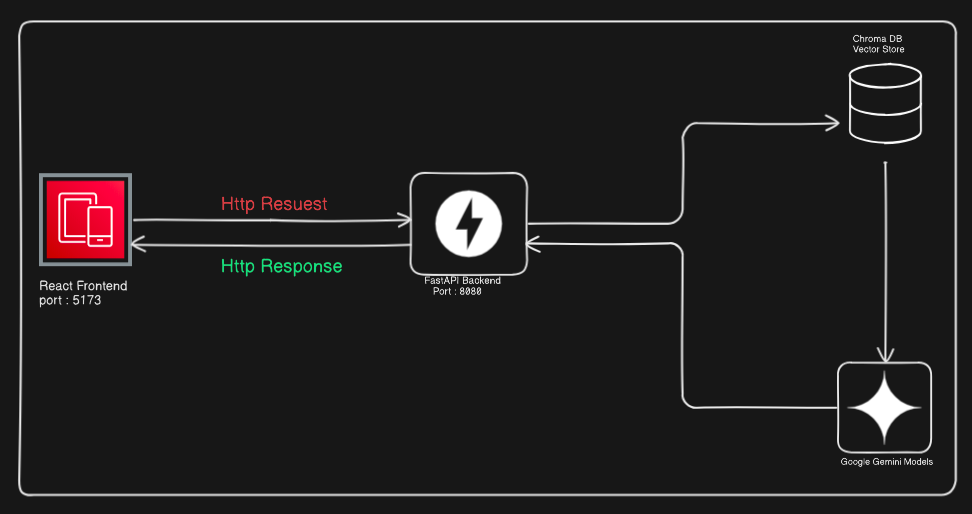

# 🎬 Transcript Assistant

An AI-powered web application that transforms YouTube videos into interactive learning experiences. Upload video transcripts, ask questions, and get intelligent answers powered by Google's Gemini AI.

   

## 🚀 Features

- **🎯 Smart Transcript Extraction**: Automatically fetch YouTube video transcripts
- **🤖 AI-Powered Q&A**: Ask questions and get intelligent answers from video content
- **🔍 Vector Search**: Advanced semantic search using Google Gemini embeddings
- **⚡ Real-time Processing**: Instant responses powered by Gemini 2.5 Flash
- **💾 Persistent Storage**: ChromaDB vector database for efficient retrieval
- **🎨 Modern UI**: Beautiful, responsive frontend with Tailwind CSS
- **🛠️ Debug Tools**: Built-in error logging and debugging capabilities

## 🏗️ Architecture


## 🛠️ Technology Stack

### Backend
- **FastAPI** - Modern Python web framework
- **LangChain** - LLM application framework
- **ChromaDB** - Vector database for embeddings
- **Google Gemini** - AI model for embeddings and chat
- **YouTube Transcript API** - Transcript extraction
- **Pydantic** - Data validation and serialization

### Frontend
- **React 18** - UI library
- **TypeScript** - Type-safe JavaScript
- **Vite** - Fast build tool and dev server
- **Tailwind CSS** - Utility-first CSS framework
- **Axios** - HTTP client for API calls
- **React Router** - Client-side routing

## 📋 Prerequisites

- **Python 3.8+** 
- **Node.js 16+** and npm
- **Google API Key** (for Gemini services)

## 🚀 Quick Start

### 1. Clone the Repository
```bash
git clone https://github.com/ManishPatidar806/Transcript-Assistance.git
cd TranscriptApplication
```

### 2. Backend Setup

```bash
# Navigate to backend directory
cd Backend

# Install Python dependencies
pip install -r requirement.txt

# Set up environment variables
export GOOGLE_API_KEY="your_google_api_key_here"

# Start the FastAPI server
python -m uvicorn app.main:app --reload --host 0.0.0.0 --port 8000
```

The backend will be available at: `http://localhost:8000`

### 3. Frontend Setup

```bash
# Navigate to frontend directory (in a new terminal)
cd Frontend

# Install Node dependencies
npm install

# Start the development server
npm run dev
```

The frontend will be available at: `http://localhost:5173`

### 4. Environment Configuration

Create a `.env` file in the `Frontend/` directory:
```env
VITE_API_BASE=http://localhost:8000/api/v1/transcript
```

## 📖 Usage Guide

### 1. Upload a Transcript
- Navigate to the home page
- Enter a YouTube video ID (e.g., `dZqa_9H803w`)
- Click "Upload" to fetch and process the transcript
- Wait for the success confirmation

### 2. Ask Questions
- Type your question in the text area
- Click "Ask" to get AI-generated answers
- View detailed responses based on the transcript content

### 3. Debug Issues
- Click "Show Debug Info" to view error logs
- Check browser console (F12) for detailed error information
- Use the built-in toast notifications for real-time feedback

## 🔧 API Endpoints

### Backend API (`http://localhost:8000/api/v1/transcript`)

| Method | Endpoint | Description | Request Body |
|--------|----------|-------------|--------------|
| GET | `/` | Health check | None |
| POST | `/upload` | Upload transcript | `{"videoId": "string"}` |
| POST | `/ask-question` | Ask question | `{"question": "string"}` |

### Response Format
```json
{
  "message": "string",
  "status": 200,
  "success": true,
  "data": "string" // Only in question responses
}
```

## 📁 Project Structure

```
TranscriptApplication/
├── Backend/
│   ├── app/
│   │   ├── main.py              # FastAPI application entry
│   │   ├── api/v1/routers/      # API route handlers
│   │   ├── core/config.py       # Configuration settings
│   │   ├── schemas/             # Pydantic schemas
│   │   └── services/            # Business logic              
│   ├── chroma_db/               # Vector database storage
│   └── requirement.txt         # Python dependencies
├── Frontend/
│   ├── src/
│   │   ├── pages/               # React page components
│   │   ├── services/            # API client
│   │   ├── App.tsx              # Main app component
│   │   ├── main.tsx             # React entry point
│   │   └── styles.css           # Global styles
│   ├── package.json             # Node dependencies
│   ├── vite.config.ts           # Vite configuration
│   └── tailwind.config.cjs      # Tailwind configuration
└── README.md                    # This file
```

## 🔑 Getting Google API Key

1. Go to [Google AI Studio](https://aistudio.google.com/)
2. Create a new project or select existing one
3. Navigate to "Get API Key"
4. Create and copy your API key
5. Set it as environment variable: `export GOOGLE_API_KEY="your_key"`

## 🐛 Troubleshooting

### Common Issues

**Backend not starting:**
- Check if Python dependencies are installed: `pip list`
- Verify Google API key is set: `echo $GOOGLE_API_KEY`
- Check port 8000 is available: `lsof -i :8000`

**Frontend build errors:**
- Clear node modules: `rm -rf node_modules && npm install`
- Check Node version: `node --version` (should be 16+)

**API connection issues:**
- Verify backend is running on port 8000
- Check CORS settings in FastAPI configuration
- Confirm VITE_API_BASE environment variable

**Transcript upload failures:**
- Ensure video has English transcripts available
- Check video ID format (11 characters, e.g., `dZqa_9H803w`)
- Verify Google API quota and billing

## 🧪 Testing

### Backend Testing
```bash
cd Backend
# Test API endpoints
curl http://localhost:8000/api/v1/transcript/
```

### Frontend Testing
```bash
cd Frontend
# Build production version
npm run build

# Preview production build
npm run preview
```

## 🚀 Production Deployment

### Backend
- Set production environment variables
- Use production ASGI server (Gunicorn + Uvicorn)
- Configure proper CORS settings
- Set up SSL certificates

### Frontend
- Build for production: `npm run build`
- Serve static files with nginx or similar
- Configure environment variables for production API

## 🤝 Contributing

1. Fork the repository
2. Create a feature branch: `git checkout -b feature/amazing-feature`
3. Commit changes: `git commit -m 'Add amazing feature'`
4. Push to branch: `git push origin feature/amazing-feature`
5. Open a Pull Request

## 📄 License

This project is licensed under the MIT License - see the LICENSE file for details.

## 👨‍💻 Author

**Manish Patidar** - Full Stack Developer

# Transcript-Assistance
# Transcript-Assistance
